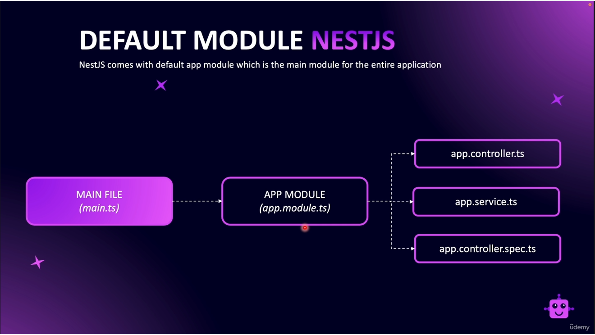

# About Your App

The entrypoint to your API is in `main.ts`. This file is where NestJS is bootstrapped
to your app. All of your app-based middleware is also used here.

The other files are your standard files for NestJS

### `app.module.ts`
A package of specific functionality. Whenever you create a new functionality in your
app, you create a new module. A module encompasses all the files related to one
aspect or functionality of the app.

### `app.service.ts`
Where the business logic is. This usually is where database operations are
done. Or if you need to connect to another service, it is also done here.

### `app.controller.ts`
Routes are defined in the controller. Route-based middleware like validators is here 
in the controller.