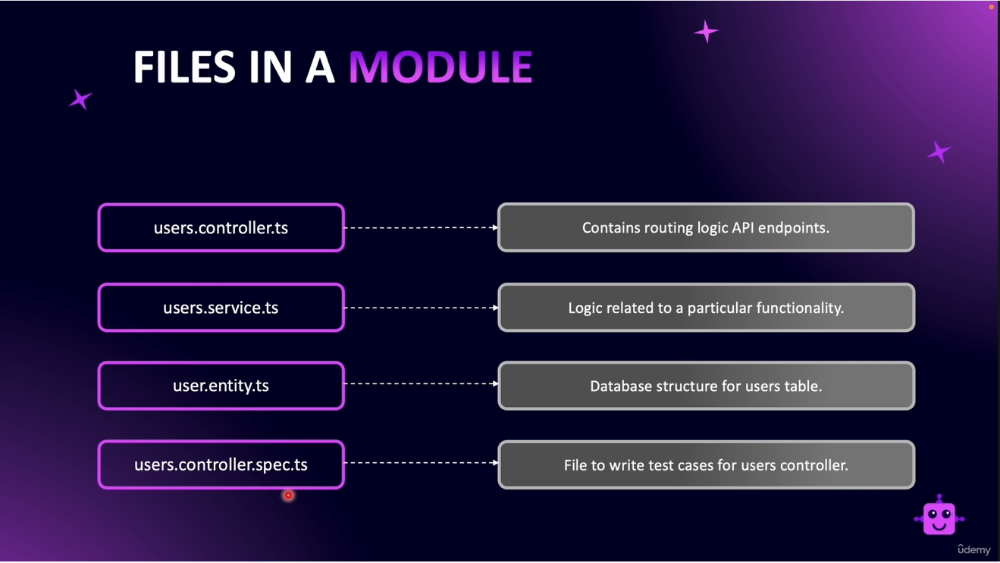

# Resource

This folder is considered a resource. Each resource has the following files:

- `users.controller.ts`: The routing logic is here in this file. This is where routing-based
middleware is used like validators and loggers.
- `users.service.ts`: Is where the business logic lies. Database interactions are done
here after being validated and processed in the controller.
- `user.entity.ts`: Database table representation. This is where you create your entity
table by code to shape your database. If you're used to Django, think models.
- `user.controller.spec.ts`(Optional): Test file for your controller.

It's good practice to add a directory for each resource called `dtos`, which houses all of
your Data Transfer Objects. Go to the `dtos`directory to learn more.